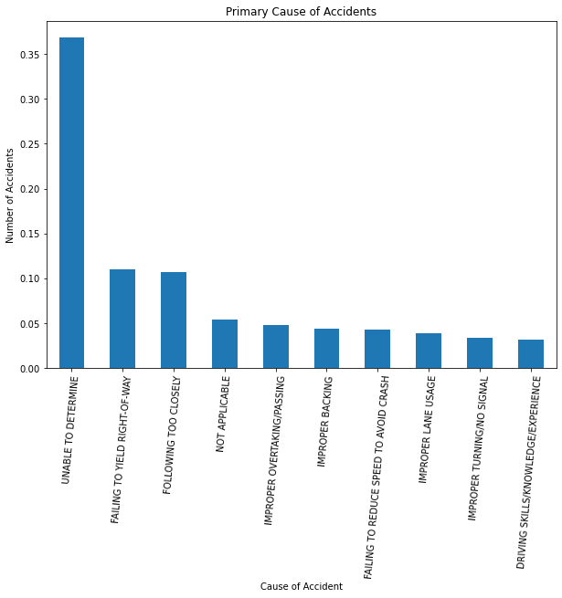
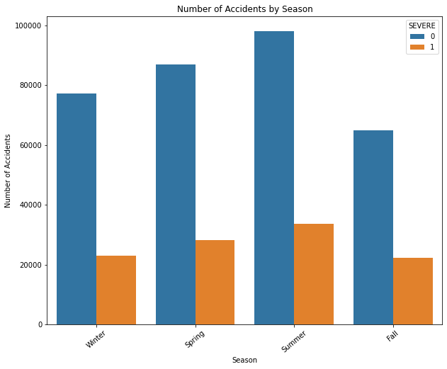
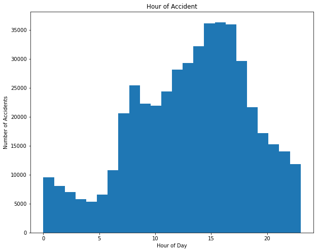
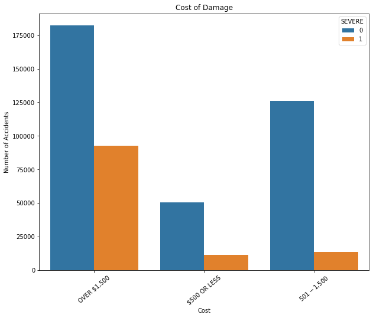

# Chicago Car Crashes Project

Build a model to predict the severity of a traffic crashes based on Chicago Police 
Department crash dataset.

# Data 

Using the data from "Chicago Car Crash Dataset" which as more than 470000 records. The dataset as details<br> of date and time of accident occurred, location and cause of accident and soon.<br>
The dataset can be found here:<br> https://data.cityofchicago.org/Transportation/Traffic-Crashes-Crashes/85ca-t3if

**Columns of the dataset represents:**

- **CRASH_RECORD_ID**  : A unique ID can be used to link to the same crash in the Vehicles                                     and people datasets. 
- **RD_NO**:             Chicago Police Department report number. 
- **CRASH_DATE_EST_I** : Crash date estimated by desk officer or reporting party.
- **CRASH_DATE** :       Date and time of crash.
- **POSTED_SPEED_LIMIT**:Posted speed limit.
- **TRAFFIC_CONTROL_DEVICE**:Traffic control device present at crash location.
- **DEVICE_CONDITION**  : Condition of traffic control device.
- **WEATHER_CONDITION** : Weather condition at time of crash.
- **LIGHTING_CONDITION**: Light condition at time of crasH.
- **FIRST_CRASH_TYPE**  : Type of first collision in crash.
- **TRAFFICWAY_TYPE**   : Trafficway type.
- **LANE_CNT**          : Total number of through lanes in either direction, excluding turn lanes.
- **ALIGNMENT**         : Street alignment at crash location.
- **ROADWAY_SURFACE_COND**:Road surface condition.
- **ROAD_DEFECT**       : Road defects.
- **REPORT_TYPE**       : Administrative report type (at scene, at desk, amended).
- **CRASH_TYPE**        : A general severity classification for the crash. Can be either Injury and/or Tow <br>Due to Crash or No Injury / Drive Away.
- **INTERSECTION_RELATED_I**:A field observation by the police officer whether an intersection played a role in the crash. Does not represent whether or not the crash occurred within the intersection.
- **NOT_RIGHT_OF_WAY_I**  :Whether the crash begun or first contact was made outside of the public 
right-of-way.
- **HIT_AND_RUN_I**      : Crash did/did not involve a driver who caused the crash and fled the <br> scene without exchanging information and/or rendering aid.
- **DAMAGE**             : A field observation of estimated damage.
- **DATE_POLICE_NOTIFIED**: Calendar date on which police were notified of the crash.
- **PRIM_CONTRIBUTORY_CAUSE**:The factor which was most significant in causing the crash.
- **SEC_CONTRIBUTORY_CAUSE** :The factor which was second most significant in causing the crash.
- **STREET_NO**            :Street address number of crash location.
- **STREET_DIRECTION**     :Street address direction (N,E,S,W) of crash location.
- **STREET_NAME**          :Street address name of crash location.
- **BEAT_OF_OCCURRENCE**   :Chicago Police Department Beat ID.
- **PHOTOS_TAKEN_I**       :Whether the Chicago Police Department took photos at the location of the 
crash.
- **STATEMENTS_TAKEN_I**   :Whether statements were taken from unit(s) involved in crash.
- **DOORING_I**            :Whether crash involved a motor vehicle occupant opening a door into the 
travel path<br> of a bicyclist, causing a crash.
- **WORK_ZONE_I**          :Whether the crash occurred in an active work zone.
- **WORK_ZONE_TYPE**       :The type of work zone.           
- **WORKERS_PRESENT_I**    :Whether construction workers were present in an active work zone at crash                             location
- **NUM_UNITS**            :Number of units involved in the crash. 
- **MOST_SEVERE_INJURY**   :Most severe injury sustained by any person involved in the crash.
- **INJURIES_TOTAL**       :Total persons sustaining fatal, incapacitating, non-incapacitating, and possible injuries.
- **INJURIES_FATAL**       :Total persons sustaining fatal injuries in the crash.
- **INJURIES_INCAPACITATING**:Total persons sustaining incapacitating/serious injuries in the crash.  - **INJURIES_NON_INCAPACITATING**:Total persons sustaining non-incapacitating injuries in the crash. -**INJURIES_REPORTED_NOT_EVIDENT**:Total persons sustaining possible injuries in the crash.       
- **INJURIES_NO_INDICATION**:Total persons sustaining no injuries in the crash.
- **INJURIES_UNKNOWN**      :Total persons for whom injuries sustained, if any, are unknown.         

- **CRASH_HOUR**            :The hour of the day component of CRASH_DATE. 
- **CRASH_DAY_OF_WEEK**     :The day of the week component of CRASH_DATE. Sunday=1                
- **CRASH_MONTH**           :The month component of CRASH_DATE.                
- **LATITUDE**              :The latitude of the crash location.             
- **LONGITUDE**             :The longitude of the crash location.            
- **LOCATION**              :The crash location.          

**Setting Up Our Data**

The modules that are imported to process the data and build the models are
- pandas for data analysis
- numpy for scientific computation
- matplotlib for basic plotting
- seaborn for advanced plotting
- sci-kit learn for modeling & evaluations

# Scrub the Data

In this stage, we'll focus on preprocessing our data. 
- Important steps such as identifying and handling null values in the columns.
- Converted object type feature to int or float type using pandas functions.
- Merged and capped  the values of columns to reduce the outliers.
- Dropped the column which are inconclusive.
- Transformed categorical variables by using one-hot encoding or "dummy variables".


# Feature Engineering

Visualization of the data using Seaborn and Matplotlib

**Below shown bar plot of top 10 Primary causes of the crash.**<br> Plots shows that most of accidents
caused are unable to determined followed by failing to yield to right of way.



 **A counter plot of the number of severe and non severe accidents in different seasons.**



Noticed that Summer time is when most of the severe and non severe occurred.

**Histogram of the crash hour**<br> To check the number of accidents in that hour.Most accidents occur during the morning and evening rush hour.



**Counter plot of Damage cost**<br> Most severe and non severe accident damage cost is more than $1500.



# Models

Performed couple different models on the data. Ran Logistic Regression model as a basic model. Used SMOTE to handle class imbalance. Tried K Nearest Neighbors, Decision Tree, Random Forest, Grid search with different models and Pipeline with with StandardScaler and Logistic Regression.
Used Logistic Regression as our Final model. Table below as the scores of f1 train,f1 test and accuracy of all model performed.

| Model | Train f1 | Test f1  |Accuracy         
| :- |:------:|:------:| :-:
|Logistic Regression| 0.75|0.75| 0.90
|Logistic Regression(SMOTE) | 0.87|0.74 | 0.89
|KNearest Neighbors |0.68|0.57|0.84
|KNN (SMOTE) |0.91|0.60|0.86
|Decision Tree|1.0|0.69|0.85
|Decision Tree(SMOTE)|1.0|0.68|0.88
|Decision Tree with GridSearch|0.86|0.70|0.86
|Random Forest|0.75|0.76|0.89
|Random Forest(SMOTE)|0.80|0.74|0.83
|Random Forest with Gridsearch|0.74|0.74|0.87
|pipeline Logistic|0.76|0.76|0.90

# Conclusion

Final models show that certain columns have more of an effect on the severity of a car accident than others.<br>
Accidents involving pedestrians are more likely to result in severe injury.<br>
Accidents where there is just a side swipe leads to non severe.

BLog Post:
https://gvijayared.medium.com/understanding-the-confusion-matrix-83a8964a872a


```python

```
